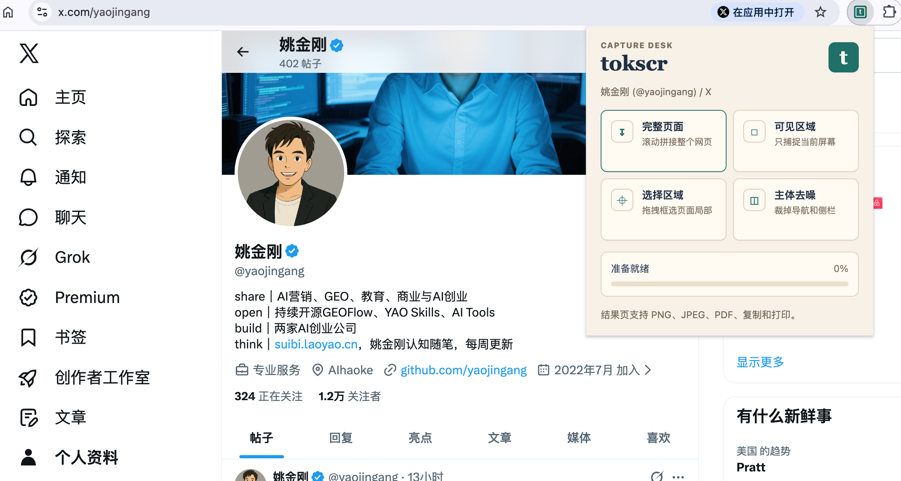
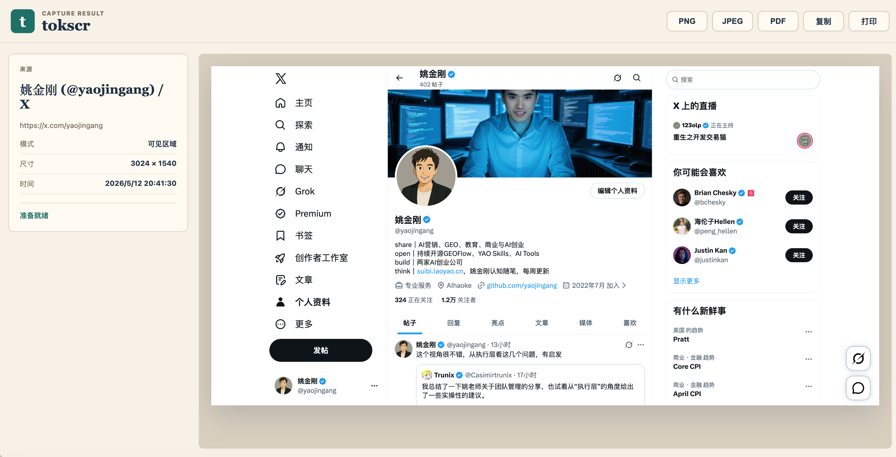

# tokscr

`tokscr` 是一个 Chrome MV3 网页截图插件，面向需要快速留存网页证据、内容页面、产品界面、长文档和社媒页面的场景。它默认在本地完成截图、拼接、预览和导出，不依赖远程服务，也不会把截图上传到服务器。

当前版本：`0.2.0`

## 截图示例

### 截图入口



### 结果工作台



## 核心亮点

- **四种截图模式**：完整页面、可见区域、选择区域、主体去噪，覆盖常见网页截图需求。
- **完整页面拼接**：自动滚动页面、分段捕捉视口，再合成为一张长图。
- **主体去噪**：自动识别文章、文档、详情页等主体内容，裁掉导航栏、侧边栏、页脚等干扰区域。
- **选择区域截图**：在网页上拖拽框选局部内容，适合截取页面中的某一块 UI 或内容段落。
- **多格式导出**：结果页支持 PNG、JPEG、PDF、复制到剪贴板和打印。
- **本地优先**：截图生成、裁剪、拼接、导出都在浏览器本地执行。
- **低权限设计**：使用 `activeTab` 和用户主动点击触发，不申请全站点长期访问权限。
- **Chrome Web Store 可发布包**：仓库内保留当前可上传包 `dist/tokscr-0.2.0.zip`。

## 功能一览

| 功能 | 说明 | 适合场景 |
| --- | --- | --- |
| 完整页面 | 自动滚动并拼接整个网页 | 长文章、文档页、详情页、社媒主页 |
| 可见区域 | 捕捉当前浏览器窗口里可见的内容 | 快速截图、当前页面状态留档 |
| 选择区域 | 拖拽框选页面局部后截图 | UI 局部、表格片段、指定内容块 |
| 主体去噪 | 识别主要内容区域并裁掉页面噪音 | 文章页、博客页、内容页、报告页 |
| PNG/JPEG | 保存为图片文件 | 分享、归档、插入文档 |
| PDF | 保存为图片型 PDF | 交付、打印、归档 |
| 复制 | 复制截图到剪贴板 | 粘贴到聊天、文档、工单 |
| 打印 | 调用浏览器打印 | 纸质留档或系统打印流程 |

## 工作逻辑

`tokscr` 由弹窗入口、后台任务、内容脚本、离屏画布和结果页组成。

```text
用户点击截图模式
        |
        v
popup.js 发送截图任务
        |
        v
background.js 调度当前标签页
        |
        v
content.js 读取页面尺寸、滚动、选择区域或主体区域
        |
        v
chrome.tabs.captureVisibleTab 捕捉视口图片
        |
        v
offscreen.js 使用 Canvas 拼接、裁剪、压缩、生成导出数据
        |
        v
capture-store.js 临时保存截图结果
        |
        v
result.html / result.js 展示、下载、复制、打印
```

### 完整页面截图

1. 内容脚本读取页面滚动尺寸、视口尺寸和设备像素比。
2. 后台脚本按视口高度拆分滚动位置。
3. 每滚动到一个位置后调用 Chrome 的当前标签截图能力捕捉可见区域。
4. 离屏页面用 Canvas 按顺序拼接所有图片块。
5. 对超长页面做尺寸保护，避免超过浏览器 Canvas 最大尺寸。

### 可见区域截图

1. 用户点击“可见区域”。
2. 后台直接捕捉当前视口。
3. 结果页展示当前屏幕内容，并提供导出操作。

### 选择区域截图

1. 内容脚本在页面上显示选择遮罩。
2. 用户拖拽框选区域。
3. 插件捕捉当前视口并按用户选择的矩形裁剪。
4. 裁剪结果进入结果页。

### 主体去噪截图

主体去噪使用本地启发式算法，不依赖 AI 服务。它会扫描页面中的常见主体容器，例如 `main`、`article`、`[role="main"]`，并结合元素面积、文本密度、位置、可见性和语义标签进行评分。

优先级大致如下：

1. 明确的语义主体容器。
2. 文本密度高、面积合理、位于页面主要阅读区域的元素。
3. 避开导航栏、页脚、侧边栏、弹窗等噪音区域。
4. 如果无法可靠判断，则退化为较大的页面主体容器，避免误裁核心内容。

## 权限说明

| 权限 | 用途 |
| --- | --- |
| `activeTab` | 用户主动点击截图后访问当前标签页，不申请长期站点权限。 |
| `scripting` | 向当前标签页注入截图辅助脚本，用于滚动、主体识别和区域选择。 |
| `offscreen` | 在离屏文档中使用 Canvas 拼接和导出截图。 |
| `storage` | 临时保存截图结果，供结果页读取。 |
| `downloads` | 将 PNG、JPEG、PDF 保存到本地磁盘。 |
| `clipboardWrite` | 用户点击复制时把截图写入剪贴板。 |

## 目录结构

```text
tools/tokscr/
  manifest.json
  background.js
  content.js
  offscreen.html
  offscreen.js
  capture-store.js
  popup.html
  popup.css
  popup.js
  result.html
  result.css
  result.js
  icons/
  store-assets/
  docs/assets/
  dist/tokscr-0.2.0.zip
```

## 本地加载

1. 打开 Chrome：`chrome://extensions/`
2. 开启右上角“开发者模式”
3. 点击“加载已解压的扩展程序”
4. 选择本仓库中的目录：

   ```text
   tools/tokscr
   ```

如果已经加载过旧版本，点击扩展卡片上的刷新按钮。

## 打包上传

当前可上传 Chrome Web Store 的包：

```text
tools/tokscr/dist/tokscr-0.2.0.zip
```

注意：zip 根目录包含 `manifest.json`，上传时不要再套一层外部文件夹。

重新打包可在 `tools/tokscr` 目录执行：

```bash
zip -r dist/tokscr-0.2.0.zip \
  manifest.json \
  background.js capture-store.js content.js \
  offscreen.html offscreen.js \
  popup.html popup.css popup.js \
  result.html result.css result.js \
  README.md icons
```

## Chrome Web Store 素材

`store-assets/` 中包含商品详情页素材和文案：

- `listing.md`：商店标题、简介、详细描述
- `privacy-policy.md`：隐私政策草稿
- `promo-small-440x280.png`：小型宣传图块
- `screenshot-1-capture-modes.png`：截图模式示例
- `screenshot-2-result-workbench.png`：结果工作台示例
- `screenshot-3-privacy.png`：隐私说明示例

## 使用限制

- Chrome 内置页面、Chrome Web Store、扩展页面等受限页面无法注入脚本，因此完整页面、主体去噪和选择区域可能不可用。
- 超长页面会自动降低导出分辨率，避免浏览器 Canvas 尺寸超限。
- PDF 导出为图片型 PDF，不是可搜索文本 PDF。
- 主体去噪是启发式识别，优先适配文章页、文档页、博客页、内容详情页。复杂 Web App 可能会退化为较大的主体容器。
- 某些网页带有固定悬浮层、懒加载图片或滚动动画，完整页面拼接时可能出现轻微重复或空白，需要按网页结构继续优化。

## 隐私设计

- 截图不上传服务器。
- 不收集用户身份信息。
- 不读取浏览历史列表。
- 不在后台持续监听页面。
- 只在用户主动点击截图功能时访问当前标签页。
- 生成的截图只临时保存在 Chrome 扩展本地存储中，用于打开结果页和完成导出。

## 后续计划

- 增加更多主体识别规则，提升复杂内容页的去噪稳定性。
- 支持更细的 PDF 页面切分和纸张尺寸设置。
- 增加截图历史管理开关。
- 增加快捷键入口。
- 增加更多商店截图和英文文档。
